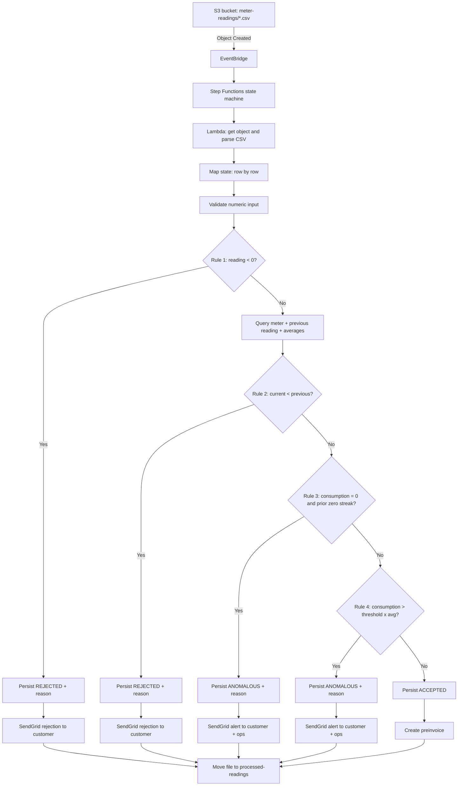

# OE-3 + OE-4: Serverless Integration Design on AWS (FinOps)

## 1) Target architecture (serverless, event-driven, cost controlled)

### AWS services
- **Amazon S3**
  - Input bucket: `meter-readings`
  - Output bucket: `processed-readings`
- **Amazon EventBridge**
  - Automatic trigger on `Object Created` events from S3
  - Push delivery to the orchestration layer, no polling
- **AWS Step Functions**
  - Central orchestrator for CSV parsing, business rules, retries, and branching
- **AWS Lambda**
  - Lightweight compute for CSV parsing, per-row validation, SQL access, and SendGrid calls
- **Amazon RDS for MySQL**
  - Tables: `meters`, `readings`, `preinvoices`
  - Dynamic thresholds stored in the database for maintainability
- **SendGrid**
  - Transactional notifications to customers
  - Operational alerts for anomalies and rejected readings

### FinOps principles
- Use **event-driven push** instead of polling to avoid idle cost.
- Keep the orchestrator in **serverless** mode: Step Functions Standard + Lambda only when needed.
- Cut early on Rule 1 to avoid unnecessary DB reads, notifications, and compute.
- Store thresholds in MySQL to avoid redeploying code for business rule changes.
- Use idempotency keys to prevent duplicate processing and duplicate billing.
- In lab environments, restrict notifications to test recipients only.

## 2) Logical flow diagram



## 3) Data model (OE-3) with dynamic thresholds

## 3.1 MySQL DDL script overview
- `meters` stores business parameters per meter.
- `readings` stores each parsed measurement and the validation result.
- `preinvoices` stores billing calculations for accepted readings.
- Thresholds are read from `meters`, not hardcoded in code.

## 3.2 SQL DDL and seed logic
See the companion script in [sql/02_create_schema_and_seed_mysql.sql](../sql/02_create_schema_and_seed_mysql.sql).

### Tables and key rules
- `meters`
  - `zero_consumption_periods` default: 2
  - `increase_threshold_pct` default: 300
  - `average_window_periods` default: 6
- `readings`
  - `status` values: `ACCEPTED`, `REJECTED`, `ANOMALOUS`
  - `consumption_kwh` is a generated column
  - unique idempotency key on `row_hash`
- `preinvoices`
  - one preinvoice per accepted reading
  - notification status: `PENDING`, `SENT`, `ERROR`

## 4) Implementation flow (OE-4) in AWS

## 4.1 Resource setup order
1. Create the S3 buckets:
   - `meter-readings`
   - `processed-readings`
2. Create Amazon RDS for MySQL with a low-cost tier for lab or early production.
3. Create the schema and seed data using the MySQL script.
4. Create a Step Functions state machine.
5. Create Lambda functions for:
   - CSV parsing
   - row validation
   - MySQL access
   - SendGrid notification
   - file move to processed bucket
6. Create an EventBridge rule for S3 `Object Created` events.
7. Attach IAM roles with the minimum permissions required.

## 4.2 Step Functions flow by states

### State 1: Trigger
- EventBridge starts the state machine when a CSV object lands in `meter-readings`.
- No polling.

### State 2: Read object
- Lambda downloads the file from S3.
- The file is decoded as UTF-8 and split into rows.

### State 3: Map row processing
- Use a Map state with controlled concurrency.
- For each row:
  1. Parse the meter code, period, and current reading.
  2. Generate `row_hash` using SHA-256 on the normalized row.
  3. Check duplicate row by `row_hash`.
  4. Apply Rule 1.
  5. If Rule 1 passes, query MySQL for the latest reading, average history, and meter thresholds.
  6. Apply Rule 2.
  7. Apply Rule 3.
  8. Apply Rule 4.
  9. Insert the final status.
  10. If accepted, create the preinvoice.

### State 4: Notification
- SendGrid sends:
  - rejection notice for rejected rows
  - alert notice for anomalous rows
  - billing notice for accepted rows

### State 5: Archive file
- Move the file from `meter-readings/` to `processed-readings/`.
- Keep the input bucket clean to reduce operational noise.

## 4.3 Pseudo-configuration for the state machine

```json
{
  "Comment": "EPM meter reading ingestion flow on AWS",
  "StartAt": "ReadObject",
  "States": {
    "ReadObject": {
      "Type": "Task",
      "Resource": "arn:aws:lambda:REGION:ACCOUNT:function:read-object",
      "Next": "ProcessRows"
    },
    "ProcessRows": {
      "Type": "Map",
      "MaxConcurrency": 25,
      "Iterator": {
        "StartAt": "ValidateRow",
        "States": {
          "ValidateRow": {
            "Type": "Task",
            "Resource": "arn:aws:lambda:REGION:ACCOUNT:function:validate-row",
            "Next": "PersistResult"
          },
          "PersistResult": {
            "Type": "Task",
            "Resource": "arn:aws:lambda:REGION:ACCOUNT:function:persist-result",
            "End": true
          }
        }
      },
      "Next": "MoveFile"
    },
    "MoveFile": {
      "Type": "Task",
      "Resource": "arn:aws:lambda:REGION:ACCOUNT:function:move-file",
      "End": true
    }
  }
}
```

## 5) Validation logic review

The recommended evaluation order is:
1. Rule 1: current reading < 0
2. Rule 2: current reading < previous reading
3. Rule 3: current consumption = 0 and previous zero streak reached
4. Rule 4: current consumption exceeds the dynamic threshold times the historical average

Why this order matters:
- Rule 1 is the cheapest check.
- Rule 2 needs only the previous reading.
- Rule 3 and Rule 4 need historical context, so they should run only after the earlier rules pass.
- This reduces Lambda invocations, SQL reads, and SendGrid traffic.

## 6) FinOps cost analysis

> Reference values only. Confirm in the AWS Pricing Calculator for the target region.

### Lab environment
- Low file volume.
- Small MySQL tier.
- Limited Lambda concurrency.
- SendGrid only for test addresses.

### Production environment
- 4,000,000 readings/month.
- File-based ingestion rather than one-object-per-reading.
- Step Functions orchestrates, Lambda performs short-lived compute.
- RDS MySQL is the dominant fixed cost.
- SendGrid can become the largest variable cost if every reading triggers an email.

### Cost drivers
| Component | Lab | Production | Main cost driver |
|---|---:|---:|---|
| S3 | Very low | Low | PUT, GET, LIST requests |
| EventBridge | Very low | Low | Events published and matched |
| Step Functions | Low | Moderate | State transitions |
| Lambda | Low | Moderate | Invocations and duration |
| RDS MySQL | Fixed low tier | Moderate to high | Instance size, storage, I/O |
| SendGrid | Free or minimal | Potentially high | Emails sent |

### Controls to avoid unexpected cost
1. Do not poll S3.
2. Batch readings into CSV files.
3. Stop processing immediately on Rule 1 and Rule 2.
4. Reuse one MySQL query to fetch all dynamic thresholds.
5. Limit Step Functions concurrency.
6. Use budget alarms in AWS Cost Explorer / Budgets.
7. Restrict SendGrid in lab.
8. Store idempotency hashes to avoid reprocessing.

## 7) Operating parameters

| Parameter | Lab | Initial production | Scale-up |
|---|---:|---:|---:|
| Step Functions concurrency | 2-5 | 10-20 | increase gradually |
| Map concurrency | 5 | 25 | 25-50 after load tests |
| CSV rows per file | 100-500 | 1,000 | 2,000 if DB remains stable |
| Average history window | 3-6 | 6-12 | by customer segment |
| Increase threshold (%) | 300% | 300% base | per business segment |

## 8) Acceptance criteria
- The three tables exist with keys, checks, and indexes.
- Rules 3 and 4 read thresholds from MySQL.
- S3 object creation starts the flow without polling.
- Accepted rows create a preinvoice.
- Rejected and anomalous rows are persisted with a reason and notification.
- The end-to-end processing target remains under 5 minutes for each reading under normal lab-scale concurrency.
