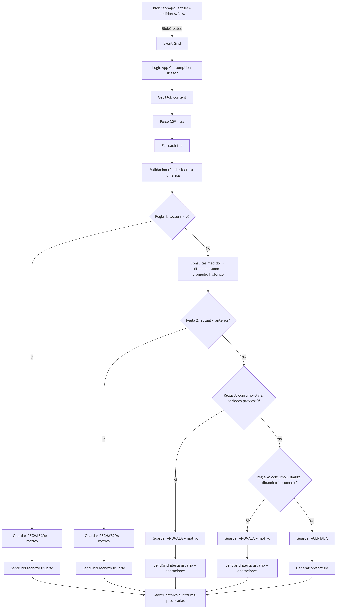

# OE-3 + OE-4: Diseño de Base de Datos e Implementación del Flujo Serverless (Azure + FinOps)

## 1) Arquitectura objetivo (serverless, event-driven, costo controlado)

### Componentes
- **Azure Blob Storage**
  - Contenedor de entrada: `lecturas-medidores`
  - Contenedor de salida: `lecturas-procesadas`
- **Azure Event Grid**
  - Suscripción al evento `BlobCreated` del contenedor `lecturas-medidores`
  - Entrega push al endpoint HTTP de Logic Apps (sin polling)
- **Azure Logic Apps (Consumption)**
  - Orquestación central
  - Parsing de CSV
  - Aplicación de reglas en orden estricto
  - Persistencia en Azure SQL
  - Envío de notificaciones con SendGrid
- **Azure SQL Database (Free Tier/Basic)**
  - Tablas: `validation_thresholds`, `strata`, `stratum_tariffs`, `meters`, `readings`, `preinvoices`
  - Umbrales configurables y tarifas por estrato administrados desde SQL (sin hardcode)
- **SendGrid**
  - Correo transaccional al usuario
  - Alertas operativas para anomalías/rechazos

### Principios FinOps aplicados
- Uso de **Event Grid + Trigger HTTP** para evitar costos de polling.
- Uso de **Logic Apps Consumption** para pagar por ejecución/acción real.
- Validaciones en cascada con **corte temprano** para reducir acciones SQL y SendGrid.
- Lectura de umbrales desde SQL para evitar hardcode y costo de cambios frecuentes en flujos.
- Idempotencia por hash de fila para evitar reproceso/cobro duplicado.
- Ambiente laboratorio con muestreo y notificaciones controladas.

## 2) Diagrama lógico del flujo (texto/Markdown)



## 3) Modelo de datos (OE-3) con umbrales dinámicos

## 3.0 Checklist de seed requerido

- Cantidad: el seed carga 100 medidores de prueba (cumple minimo de 50).
- Variedad de estratos: el seed distribuye medidores en estratos 1..6 para aplicar tarifas diferenciadas.
- Consumos historicos: el seed configura `historical_avg_consumption_kwh` con valores bajos en un subconjunto de medidores para permitir disparar Regla 4 al cargar CSV con consumos altos.
- Lecturas anteriores: el seed incluye lecturas historicas para validar Regla 2 (lectura menor a la anterior), Regla 3 (tres periodos consecutivos con consumo 0 en medidores seleccionados) y Regla 4 (consumo atipico sobre promedio historico).
- Recomendacion de liderazgo: el umbral de consumo atipico del 300% se configura en `validation_thresholds` y no queda hardcoded en Logic App.
- Contrato de estados: `readings` usa `ACCEPTED`, `ANOMALOUS` y `REJECTED`; `preinvoices` usa `PENDING`, `SENT` y `PAID`.

## 3.1 Script SQL DDL (modelo base)

> Actualización implementada en scripts del repositorio:
> - Tabla `validation_thresholds` para Regla 1 (lectura negativa), Regla 3 (cero prolongado),
>   Regla 4 (consumo atípico) y ventana histórica de 6 meses.
> - Tablas `strata` y `stratum_tariffs` para tarifas por estrato.
> - Campo `historical_avg_consumption_kwh` en `meters` para almacenar promedio histórico por medidor.
> - Los constraints relacionales y de validación se agregan después del seed, para que el script cargue datos y luego valide PK, FK, UQ y CHECK contra lo sembrado.

> Nota: el bloque SQL siguiente es solo un extracto conceptual; la implementación vigente y ejecutable está en `sql/01_create_schema_and_seed.sql`.

## 3.3 Restricciones aplicadas post-seed

- Tabla de meters: `meter_id` es PK; `customer_id`, `address`, `socioeconomic_stratum` y `tariff_kwh` son obligatorios; `meter_code` es único; `historical_avg_consumption_kwh` y los umbrales quedan parametrizables.
- Tabla de readings: `meter_id` tiene integridad referencial contra meters; `status` solo admite `ACCEPTED`, `ANOMALOUS` y `REJECTED`; `reason` es obligatorio para `ANOMALOUS` y `REJECTED`; una lectura rechazada puede ser negativa o menor que la anterior, pero no una aceptada o anómala.
- Tabla de preinvoices: solo se generan para lecturas `ACCEPTED` o `ANOMALOUS`; `manual_review_pending = 1` marca las derivadas de lecturas anómalas; `notification_status` solo admite `PENDING`, `SENT` y `PAID`; `notification_date_utc` es obligatoria cuando el estado ya fue notificado o pagado.
- Reglas 3 y 4: por depender del historial de lecturas y del promedio del medidor, se validan en la Logic App con la consulta dinámica a SQL y quedan respaldadas por el seed histórico.

```sql
-- Recomendado: Azure SQL Database, compatibilidad 150+

-- 1) Table: meters (aligned with seed model)
CREATE TABLE dbo.meters (
  meter_id                         BIGINT IDENTITY(1,1) PRIMARY KEY,
  meter_code                       NVARCHAR(50) NOT NULL,
  customer_id                      NVARCHAR(50) NOT NULL,
  address                          NVARCHAR(200) NOT NULL,
  notification_email               NVARCHAR(320) NOT NULL,
  socioeconomic_stratum            TINYINT NOT NULL,
  is_active                        BIT NOT NULL CONSTRAINT DF_meters_is_active DEFAULT (1),
  zero_consumption_periods         TINYINT NOT NULL CONSTRAINT DF_meters_zero_periods DEFAULT (2),
  increase_threshold_pct           DECIMAL(6,2) NOT NULL CONSTRAINT DF_meters_threshold DEFAULT (300.00),
  average_window_periods           TINYINT NOT NULL CONSTRAINT DF_meters_avg_window DEFAULT (6),
  historical_avg_consumption_kwh   DECIMAL(18,3) NOT NULL CONSTRAINT DF_meters_hist_avg DEFAULT (0),
  tariff_kwh                       DECIMAL(12,4) NOT NULL,
  created_at_utc                   DATETIME2(3) NOT NULL CONSTRAINT DF_meters_created DEFAULT (SYSUTCDATETIME()),
  updated_at_utc                   DATETIME2(3) NOT NULL CONSTRAINT DF_meters_updated DEFAULT (SYSUTCDATETIME()),

  CONSTRAINT UQ_meters_code UNIQUE (meter_code),
  CONSTRAINT CK_meters_email CHECK (notification_email LIKE '%_@_%._%'),
  CONSTRAINT CK_meters_zero_periods CHECK (zero_consumption_periods BETWEEN 1 AND 12),
  CONSTRAINT CK_meters_threshold CHECK (increase_threshold_pct >= 100.00 AND increase_threshold_pct <= 10000.00),
  CONSTRAINT CK_meters_avg_window CHECK (average_window_periods BETWEEN 1 AND 24),
  CONSTRAINT CK_meters_tariff CHECK (tariff_kwh > 0)
);
GO

CREATE INDEX IX_meters_customer ON dbo.meters(customer_id);
GO

-- 2) Table: readings
CREATE TABLE dbo.readings (
  reading_id                BIGINT IDENTITY(1,1) PRIMARY KEY,
  meter_id                  BIGINT NOT NULL,
  period_date               DATE NOT NULL,
  previous_reading          DECIMAL(18,3) NOT NULL,
  current_reading           DECIMAL(18,3) NOT NULL,
  consumption_kwh           AS (current_reading - previous_reading) PERSISTED,
  status                    VARCHAR(10) NOT NULL, -- ACCEPTED | REJECTED | ANOMALOUS
  reason                    NVARCHAR(200) NULL,
  source_file               NVARCHAR(260) NOT NULL,
  row_hash                  CHAR(64) NOT NULL,
  created_at_utc            DATETIME2(3) NOT NULL CONSTRAINT DF_readings_created DEFAULT (SYSUTCDATETIME()),

  CONSTRAINT FK_readings_meters FOREIGN KEY (meter_id) REFERENCES dbo.meters(meter_id),
  CONSTRAINT UQ_readings_row_hash UNIQUE (row_hash),
  CONSTRAINT UQ_readings_meter_period UNIQUE (meter_id, period_date),
  CONSTRAINT CK_readings_status CHECK (status IN ('ACCEPTED','REJECTED','ANOMALOUS')),
  CONSTRAINT CK_readings_rule1_consistency CHECK (status = 'REJECTED' OR current_reading >= 0),
  CONSTRAINT CK_readings_rule2_consistency CHECK (status = 'REJECTED' OR current_reading >= previous_reading)
);
GO

CREATE INDEX IX_readings_meter_period ON dbo.readings(meter_id, period_date DESC);
CREATE INDEX IX_readings_status_date ON dbo.readings(status, created_at_utc DESC);
GO

-- 3) Table: preinvoices
CREATE TABLE dbo.preinvoices (
  preinvoice_id                BIGINT IDENTITY(1,1) PRIMARY KEY,
  reading_id                   BIGINT NOT NULL,
  meter_id                     BIGINT NOT NULL,
  period_date                  DATE NOT NULL,
  tariff_kwh                   DECIMAL(12,4) NOT NULL,
  billable_consumption_kwh     DECIMAL(18,3) NOT NULL,
  subtotal                     DECIMAL(18,2) NOT NULL,
  tax_pct                      DECIMAL(5,2) NOT NULL CONSTRAINT DF_preinvoices_tax DEFAULT (19.00),
  tax_amount                   DECIMAL(18,2) NOT NULL,
  total_amount                 DECIMAL(18,2) NOT NULL,
  notification_status          VARCHAR(15) NOT NULL CONSTRAINT DF_preinvoices_notif DEFAULT ('PENDING'),
  manual_review_pending        BIT NOT NULL CONSTRAINT DF_preinvoices_manual_review DEFAULT (0),
  notification_date_utc        DATETIME2(3) NULL,
  created_at_utc               DATETIME2(3) NOT NULL CONSTRAINT DF_preinvoices_created DEFAULT (SYSUTCDATETIME()),

  CONSTRAINT FK_preinvoices_readings FOREIGN KEY (reading_id) REFERENCES dbo.readings(reading_id),
  CONSTRAINT FK_preinvoices_meters FOREIGN KEY (meter_id) REFERENCES dbo.meters(meter_id),
  CONSTRAINT UQ_preinvoices_reading UNIQUE (reading_id),
  CONSTRAINT CK_preinvoices_amounts CHECK (
    tariff_kwh > 0 AND
    billable_consumption_kwh >= 0 AND
    subtotal >= 0 AND
    tax_pct BETWEEN 0 AND 100 AND
    tax_amount >= 0 AND
    total_amount >= 0
  ),
  CONSTRAINT CK_preinvoices_notif_status CHECK (notification_status IN ('PENDING','SENT','PAID'))
);
GO

CREATE INDEX IX_preinvoices_meter_period ON dbo.preinvoices(meter_id, period_date DESC);
GO
```

## 3.2 Consulta base para umbrales dinámicos por medidor

```sql
-- Input: @meter_code, @period_date
-- Salida esperada para la Logic App:
-- - previous_reading
-- - historical_avg_consumption_kwh
-- - previous_zero_consumption_periods
-- - increase_threshold_pct
-- - zero_consumption_periods
-- - tariff_kwh

DECLARE @meter_code NVARCHAR(50) = @p_meter_code;

SELECT
  m.meter_id,
  m.tariff_kwh,
  m.increase_threshold_pct,
  m.zero_consumption_periods,
  m.average_window_periods,

    -- Ultima lectura conocida (para Regla 2)
    ISNULL((
        SELECT TOP (1) l.current_reading
        FROM dbo.readings l
        WHERE l.meter_id = m.meter_id
          AND l.status IN ('ACCEPTED','ANOMALOUS')
        ORDER BY l.period_date DESC
    ), 0) AS previous_reading,

    -- Promedio historico de consumo (Regla 4)
    ISNULL((
        SELECT AVG(CAST(l.consumption_kwh AS DECIMAL(18,3)))
        FROM (
          SELECT TOP (CASE WHEN m.average_window_periods < 1 THEN 1 ELSE m.average_window_periods END)
            l2.consumption_kwh
          FROM dbo.readings l2
          WHERE l2.meter_id = m.meter_id
            AND l2.status IN ('ACCEPTED','ANOMALOUS')
          ORDER BY l2.period_date DESC
        ) l
    ), 0) AS historical_avg_consumption_kwh,

    -- Conteo de ceros consecutivos previos (Regla 3)
    ISNULL((
        SELECT COUNT(1)
        FROM (
            SELECT TOP (CASE WHEN m.zero_consumption_periods < 1 THEN 1 ELSE m.zero_consumption_periods END)
                l3.consumption_kwh
            FROM dbo.readings l3
            WHERE l3.meter_id = m.meter_id
              AND l3.status IN ('ACCEPTED','ANOMALOUS')
            ORDER BY l3.period_date DESC
        ) z
        WHERE z.consumption_kwh = 0
    ), 0) AS previous_zero_consumption_periods
FROM dbo.meters m
  WHERE m.meter_code = @meter_code
  AND m.is_active = 1;
```

## 4) Implementación del flujo (OE-4) en Logic Apps Consumption

## 4.1 Configuración de recursos (orden recomendado)
1. Crear `Storage Account` (SKU Standard LRS) y contenedores:
   - `lecturas-medidores`
   - `lecturas-procesadas`
2. Crear `Azure SQL Database` (Free Tier/Basic) y ejecutar DDL.
3. Crear `Logic App (Consumption)` con identidad administrada.
4. Crear `Event Grid Subscription` sobre Storage:
   - Event type: `Microsoft.Storage.BlobCreated`
   - Endpoint: trigger HTTP de la Logic App.
   - Filtro por prefijo: `/blobServices/default/containers/lecturas-medidores/blobs/`
   - Filtro por sufijo: `.csv`
5. Configurar API Connection a SQL con Managed Identity.
6. Configurar API Connection a SendGrid (API Key restringida a Mail Send).

## 4.2 Flujo lógico por bloques (optimizado para costo)

### Trigger
- `When a resource event occurs` (Event Grid)
- Sin polling.
- Concurrency control del trigger habilitado (ejemplo: 20) para paralelismo seguro.

### Bloque A: Obtener archivo
1. `Get blob content using path` desde `url`/`subject` del evento.
2. `Compose` para normalizar texto (UTF-8, salto de línea).

### Bloque B: Parsing CSV
1. `Compose headers` = primera línea.
2. `Compose rows` = `skip(split(body('ComposeTexto'), '\n'), 1)`
3. `For each row` (concurrency recomendada: 25 en producción; 5 en laboratorio).

### Bloque C: Validación en orden estricto con corte temprano
Para cada fila:
1. Parsear columnas esperadas: `meter_code`, `period_date`, `current_reading`.
2. Calcular `hash_fila = SHA256(archivo + fila_normalizada)`.
3. Verificar duplicado en SQL por `hash_fila`.
   - Si existe: `Terminate item` (no reprocesar, no cobrar acciones extra).
4. **Regla 1**: si `current_reading < 0`
  - Insert `readings` con `status='REJECTED'`, motivo `R1_NEGATIVE_READING`.
   - SendGrid rechazo al usuario.
   - `Continue` al siguiente item.
5. Consultar SQL (una sola query) para traer:
  - `previous_reading`, `historical_avg`, `previous_zero_streak`,
  - `atypical_consumption_pct`, `zero_consumption_periods`, `negative_reading_min_kwh`, `tariff_kwh` por estrato.
6. **Regla 2**: si `current_reading < previous_reading`
  - Insert `REJECTED` con motivo `R2_CURRENT_LOWER_THAN_PREVIOUS`.
   - Notificación rechazo.
   - `Continue`.
7. Calcular `consumption_kwh = current_reading - previous_reading`.
8. **Regla 3**: si `consumption_kwh = 0` y `previous_zero_streak >= zero_consumption_periods`
  - Insert `ANOMALOUS` con motivo `R3_ZERO_CONSUMPTION_STREAK`.
   - Enviar alerta usuario + operaciones.
   - `Continue`.
9. **Regla 4**: si `historical_avg > 0` y
  `consumption_kwh > (increase_threshold_pct/100.0) * historical_avg`
  - Insert `ANOMALOUS` con motivo `R4_ATYPICAL_CONSUMPTION`.
   - Enviar alerta usuario + operaciones.
   - `Continue`.
10. Si no activó reglas:
   - Insert `ACCEPTED`.
   - Crear `preinvoices`:
     - `subtotal = consumption_kwh * tariff_kwh`
     - `tax_amount = subtotal * (tax_pct/100)`
     - `total_amount = subtotal + tax_amount`
   - SendGrid notificación transaccional al usuario.

Regla adicional de preinvoices:
- Las lecturas `ANOMALOUS` también generan preinvoice, pero con `manual_review_pending = 1` y estado `PENDING` hasta revisión.
- Las lecturas `REJECTED` no generan preinvoice.

### Bloque D: Cierre de archivo
1. Copiar/mover archivo a `lecturas-procesadas/yyyy/MM/dd/`.
2. (Opcional) eliminar blob de entrada tras movimiento exitoso.
3. Registrar métricas de procesamiento (Application Insights / Log Analytics).

## 4.3 Esqueleto JSON (Logic App Definition - simplificado)

```json
{
  "definition": {
    "$schema": "https://schema.management.azure.com/providers/Microsoft.Logic/schemas/2019-05-01/workflowdefinition.json#",
    "triggers": {
      "When_BlobCreated_EventGrid": {
        "type": "ApiConnectionWebhook",
        "inputs": {
          "host": { "connection": { "name": "@parameters('$connections')['eventgrid']['connectionId']" } },
          "body": {
            "properties": {
              "topic": "/subscriptions/.../resourceGroups/.../providers/Microsoft.Storage/storageAccounts/<sa>",
              "destination": { "endpointType": "webhook" },
              "filter": {
                "includedEventTypes": ["Microsoft.Storage.BlobCreated"],
                "subjectBeginsWith": "/blobServices/default/containers/lecturas-medidores/blobs/",
                "subjectEndsWith": ".csv"
              }
            }
          },
          "path": "/subscriptions/@{encodeURIComponent('...')}/providers/@{encodeURIComponent('Microsoft.EventGrid')}/resource/eventSubscriptions"
        }
      }
    },
    "actions": {
      "Get_blob_content": { "type": "ApiConnection" },
      "Parse_rows": { "type": "Compose" },
      "For_each_row": {
        "type": "Foreach",
        "runtimeConfiguration": {
          "concurrency": { "repetitions": 25 }
        },
        "actions": {
          "Check_duplicate_hash": { "type": "ApiConnection" },
          "If_Regla_1": { "type": "If" },
          "Get_dynamic_thresholds_from_SQL": { "type": "ApiConnection" },
          "If_Regla_2": { "type": "If" },
          "If_Regla_3": { "type": "If" },
          "If_Regla_4": { "type": "If" },
          "Insert_accepted_and_preinvoice": { "type": "ApiConnection" },
          "SendGrid_Notify": { "type": "ApiConnection" }
        }
      },
      "Move_blob_to_processed": { "type": "ApiConnection" }
    }
  }
}
```

## 5) Autovalidación de lógica anidada (optimización)

Checklist aplicado sobre el flujo:
- Reglas implementadas en orden estricto R1 -> R2 -> R3 -> R4.
- Corte temprano con `Continue` por cada regla disparada.
- Consulta SQL pesada (histórico/promedio) solo después de superar R1.
- Notificaciones solo para estados finales (sin correos intermedios).
- Idempotencia (`hash_fila`) antes de validación para ahorrar costo.
- `For each` con concurrencia configurable por entorno para controlar RU/DTU.

Resultado: se minimiza procesamiento innecesario y número total de acciones facturables por fila.

## 6) FinOps: costos estimados y control presupuestal

> Valores referenciales (abril 2026). Confirmar en Azure Pricing Calculator según región.

## 6.1 Supuestos de dimensionamiento
- 4,000,000 filas/mes.
- 1 evento por archivo; ejemplo productivo: 4,000 archivos de 1,000 filas.
- ~8-14 acciones de Logic App por fila (dependiendo de regla y notificación).
- Event Grid push (sin polling).
- SendGrid: en producción domina el costo si se notifica cada lectura.

## 6.2 Costeo comparativo (referencial)

| Componente | Laboratorio (10,000 filas/mes) | Producción (4,000,000 filas/mes) | Driver de costo |
|---|---:|---:|---|
| Event Grid operaciones | Muy bajo / puede entrar en free grant | Bajo-medio | # eventos publicados + entregados |
| Logic Apps Consumption | Bajo | Alto controlable | # acciones ejecutadas |
| Azure SQL Free/Basic | Casi fijo | Fijo + posible escalado | DTU/vCore y almacenamiento |
| Blob Storage transacciones | Bajo | Bajo-medio | operaciones read/write/list |
| SendGrid | Free tier suficiente para pruebas | Muy alto si 1 correo por lectura | # correos enviados |

## 6.3 Fórmulas FinOps útiles
- `Costo Logic Apps ≈ (acciones_totales / 1,000) * precio_por_1,000_acciones`
- `acciones_totales = filas_procesadas * acciones_promedio_por_fila`
- `Costo Event Grid ≈ (ops_eventgrid / 1,000,000) * precio_por_millon`
- `Costo SendGrid ≈ correos_enviados * costo_unitario_plan`

## 6.4 Controles para evitar costos inesperados
1. No usar polling en ningún conector de entrada.
2. Agrupar lecturas por archivo (ej. 500-2,000 filas por CSV) para reducir eventos.
3. Early-exit por regla para recortar acciones.
4. Configurar límites de concurrencia en `For each` y trigger.
5. Activar `Azure Budget + Alertas` por resource group.
6. Habilitar retención corta de logs en laboratorio.
7. SendGrid en laboratorio:
   - enviar solo a lista de prueba o solo anomalías.
8. Usar `hash_fila` para evitar reprocesos y doble notificación.

## 7) Parámetros mínimos de operación (recomendado)

| Parámetro | Laboratorio | Producción inicial | Escalamiento |
|---|---:|---:|---|
| Concurrency Trigger Logic App | 2-5 | 10-20 | subir gradualmente según DTU |
| Concurrency For each | 5 | 25 | 25-50 con pruebas de carga |
| Filas por CSV | 100-500 | 1,000 | 2,000 si SQL responde estable |
| Ventana promedio histórica | 3-6 | 6-12 | por segmento de cliente |
| Umbral incremento (%) | 300% | 300% base | ajustar por tipo de usuario |

## 8) Criterios de aceptación técnicos (OE-3/OE-4)
- Existen `validation_thresholds`, `strata`, `stratum_tariffs`, `meters`, `readings` y `preinvoices` con constraints, índices y FK.
- Los umbrales de R1/R3/R4 se leen desde `validation_thresholds` (no hardcoded).
- `meters` incluye `historical_avg_consumption_kwh` para soporte de comparación histórica.
- El cálculo de prefactura usa tarifa por estrato desde `stratum_tariffs`.
- Trigger por `BlobCreated` funcional sin polling.
- Para una fila válida, estado `ACCEPTED` + registro en `preinvoices`.
- Para anomalías/rechazos, estado correcto + motivo + notificación.
- Tiempo objetivo por lectura: <= 5 minutos end-to-end (con concurrencia ajustada).
